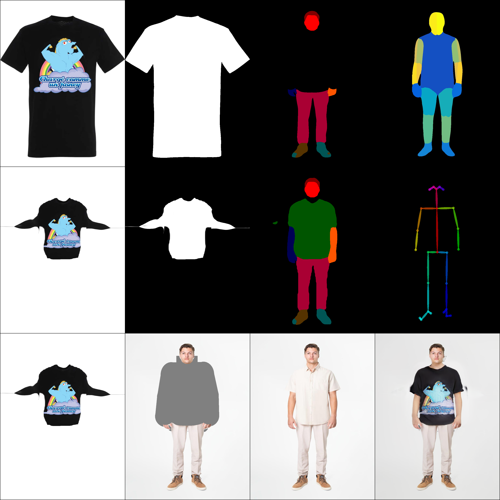

# VF-MARKET: 가상피팅 기능을 적용한 온라인 중고거래 마켓


## 팀

### 팀명: SFTB(Start From The Bottom)

### 팀원

| 이름   | 학번      | 담당             |
| ------ | --------- | ---------------- |
| 김진혁 | 201520874 | 프론트엔드, 팀장 |
| 이동현 | 202020983 | 백엔드           |
| 이정훈 | 201720770 | 머신러닝, 백엔드 |
| 전강우 | 201720749 | 프론트엔드       |

## 목차

1. [프로젝트 소개](#프로젝트-소개)
2. [기술스택](#사용한-기술)
3. [소프트웨어 아키텍처 및 알고리즘](#소프트웨어-아키텍처-및-알고리즘)
4. [핵심 기능](#핵심-기능)
5. [활용 기술](#활용-기술)

## 프로젝트 소개

- 이 프로젝트는 아주대학교 캡스톤디자인 과목의 프로젝트를 위해 작성됨
- 본 프로젝트는 가상 피팅을 활용한 온라인 중고거래 마켓을 기획한 프로젝트임
- 여러 상품에 대해 자신의 스타일과 어울리는지 비교를 해보고 싶은 경우
- 온라인으로 상품을 구매했을 때 상품이 구매자의 예상과 맞지 않는 것을 피하고 싶은 경우
- 위와 같은 사람들을 위해서 Virtual fitting 기능을 통한 간접 경험을 제공하고자 'VF-MARKET'을 기획하게 되었다.

## 사용한 기술

- 프로젝트를 위해 아래의 환경을 구성하여 구현함

| 분야         | 사용                |
| ------------ | ------------------- |
| 프론트엔드   | Vue.js, Bootstrap   |
| 백엔드       | Spring Boot         |
| 데이터베이스 | MySQL               |
| 머신러닝     | Google Colab, Flask |
| 서버         | AWS                 |

[](assets/techs.png)

## 소프트웨어 아키텍처 및 알고리즘

[](assets/sw-arch-alg.png)

## 핵심 기능

### 1. 가상 피팅 이미 생성 / 조회

- 구매자 본인의 전신 사진과 상품을 합성함
- 합성을 위해서는 6개의 전처리 데이터가 필요함(원본 코드 모두 오픈소스 사용)
  - Openpose
  - Human parse
  - Densepose
  - Cloth mask
  - Parse agnostic
  - Human agnostic
- 합성된 이미지를 구매자가 조회하고 마음에 들면 상품을 선택함
  
  위 사진의 의미는 다음과 같다.

|              |                 |                |                  |
| :----------- | :-------------: | :------------: | :--------------: |
| 옷 원본 사진 |   Cloth mask    | Parse agnostic |    Densepose     |
| 옷 변형 사진 | Cloth mask 변형 |  Human parse   |     Openpose     |
| 옷 변형 사진 | Human agnostic  | 사람 원본 사진 | 합성된 결과 사진 |

## 활용 기술

### 1. 외부 API

#### 1-1. Google Gmail SMTP Server


- Google Gmail의 SMTP 서버를 통해 회원에게 인증번호 등의 메일을 보낸다.

#### 1-2. PortOne 결제


- PortOne의 결제 시스템을 통해 상품 결제를 구현했다.

### 2. 오픈소스

#### 2-1. Openpose

- [Github Link](https://github.com/CMU-Perceptual-Computing-Lab/openpose "Openpose 사용")
- Openpose 전처리에 필요
- 사람의 자세를 감지하고, 신체 부위를 점과 선으로 표현하여 결과를 이미지와 json파일로 나타낸다.

#### 2-2. CIHP_PGN

- [Github Link](https://github.com/Engineering-Course/CIHP_PGN "Human parse에 사용")
- Human parse 전처리에 필요
- 사람의 신체 부위를 색으로 각각 parse해서 각기 다른 색으로 표현함
- Tensorflow 1 버전으로 작성되었으나, Google Colab은 더 이상 1 버전을 지원하지 않아서 2 버전으로 업그레이드 해서 코드를 변경해서 사용함

```
cd CHIP_PGN
tf_upgrade_v2 --intree . --outtree . --copyotherfiles False
```

#### 2-3. detectron2

- [Github Link](https://github.com/facebookresearch/detectron2 "Densepose에 사용")
- Densepose 전처리에 필요
- 사람의 자세를 감지하고 신체 부위를 색으로 표현함

#### 2-4. CarveKit

- [Github Link](https://github.com/OPHoperHPO/image-background-remove-tool/releases "이미지에서 배경을 없애는데 사용함. Cloth mask에 필요")
- Cloth mask 전처리에 필요
- Masking한 상품 이미지에서 배경을 없애는데 사용함

#### 2-5. HR-VITON

- [Github Link](https://github.com/sangyun884/HR-VITON "학습 모델. Parse agnostic, Human agnostic도 제공됨")
- **이번 가상 피팅의 메인 모델 학습용 오픈소스**
- 학습 외에도, Parse agnostic과 Human agnostic 전처리에 필요한 코드도 제공함
- 각각 human parse와 원본 이미지에서 상품 이미지를 합성할 신체 부위를 따기 위해 필요함
- Google Colab에서 돌리기 위해 [여기](https://github.com/sangyun884/HR-VITON/issues/45)를 참조함

### 3. 그 외

#### Google Colab Pro Plus


- 구글 Colab을 통해 모델 학습 진행함
- 로컬에서는 학습이 사실상 불가능한 문제 외에도, 각 오픈소스의 Python, Pytorch, Tensorflow 버전 등의 호환 문제도 있어서 부득이하게 Colab에서 학습 및 데이터 전처리를 진행할 수밖에 없었음.
- 합성할 사진을 받으면 전처리가 항상 필요하므로 Colab에서 Flask를 써서 돌리기로 함.
