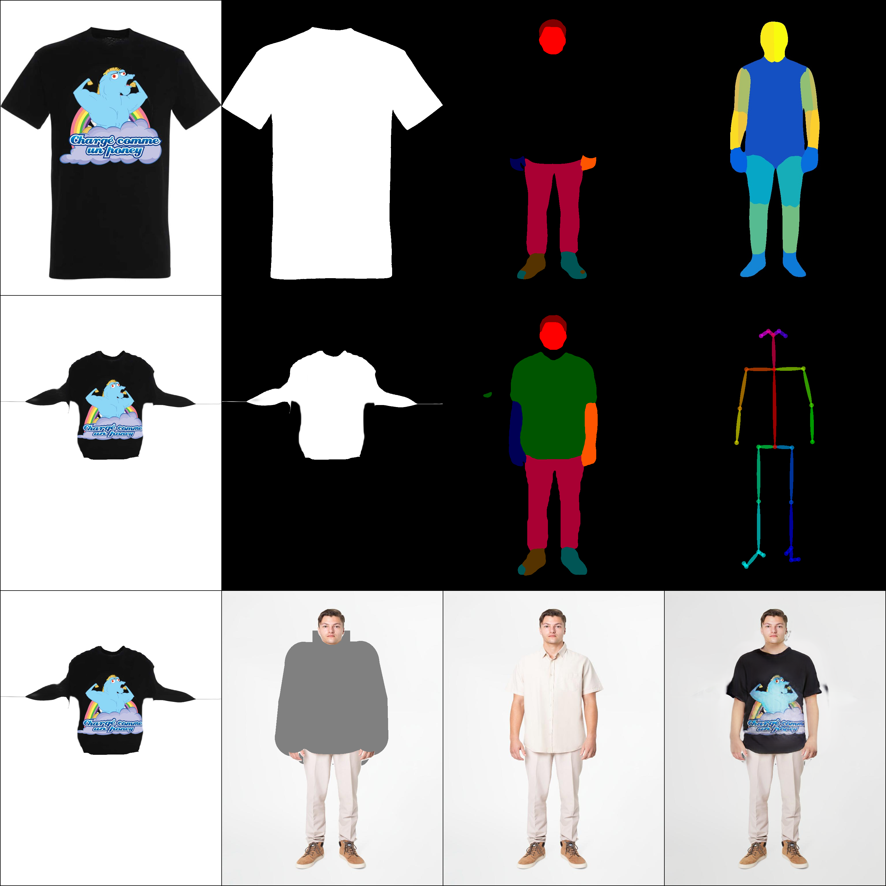

# VF-MARKET: 가상피팅 기능을 적용한 온라인 중고거래 마켓


## 팀

### 팀명: SFTB(Start From The Bottom)

### 팀원

| 이름   | 학번      | 담당             |
| ------ | --------- | ---------------- |
| 이정훈 | 201720770 | 머신러닝, 백엔드 |

## 목차

1. [프로젝트 소개](#프로젝트-소개)
2. [사용한 기술](#사용한-기술)

## 프로젝트 소개

- 이 프로젝트는 아주대학교 캡스톤디자인 과목의 프로젝트를 위해 작성됨
- 본 프로젝트는 가상 피팅을 활용한 온라인 중고거래 마켓을 기획한 프로젝트임
- 여러 상품에 대해 자신의 스타일과 어울리는지 비교를 해보고 싶은 경우
- 온라인으로 상품을 구매했을 때 상품이 구매자의 예상과 맞지 않는 것을 피하고 싶은 경우
- 위와 같은 사람들을 위해서 Virtual fitting 기능을 통한 간접 경험을 제공하고자 'VR-MARKET'을 기획하게 되었다.

## 핵심 기능

### 1. 가상 피팅 이미 생성 / 조회

- 구매자 본인의 전신 사진과 상품을 합성함
- 합성을 위해서는 6개의 전처리 데이터가 필요함(원본 코드 모두 오픈소스 사용)
  - Openpose
  - Human parse
  - Densepose
  - Cloth mask
  - Parse agnostic
  - Human agnostic
- 합성된 이미지를 구매자가 조회하고 마음에 들면 상품을 선택함
  
  위 사진의 의미는 다음과 같다.

|              |                 |                |                  |
| :----------- | :-------------: | :------------: | :--------------: |
| 옷 원본 사진 |   Cloth mask    | Parse agnostic |    Densepose     |
| 옷 변형 사진 | Cloth mask 변형 |  Human parse   |     Openpose     |
| 옷 변형 사진 | Human agnostic  | 사람 원본 사진 | 합성된 결과 사진 |

## 사용한 오픈소스

### 1. Openpose

- [Github Link](https://github.com/CMU-Perceptual-Computing-Lab/openpose "Openpose 사용")
- Openpose 전처리에 필요
- 사람의 자세를 감지하고, 신체 부위를 점과 선으로 표현하여 결과를 이미지와 json 파일로 나타낸다.

### 2. CIHP_PGN

- [Github Link](https://github.com/Engineering-Course/CIHP_PGN "Human parse에 사용")
- Human parse 전처리에 필요
- 사람의 신체 부위를 색으로 각각 parse해서 각기 다른 색으로 표현함
- Tensorflow 1 버전으로 작성되었으나, Google Colab은 더 이상 1 버전을 지원하지 않아서 2 버전으로 업그레이드 해서 코드를 변경해서 사용함

```
cd CHIP_PGN
tf_upgrade_v2 --intree . --outtree . --copyotherfiles False
```

- 위와 같이 CHIP_PGN 디렉토리에서 tf_upgrade_v2 명령어로 디렉토리 내의 모든 Python 파일의 TensorFlow 코드를 2버전으로 업그레이드 한다.
- 그리고 CIHP_PGN/kaffe/tensorflow/network.py 파일의 코드를 수정한다.

```python
import numpy as np
import tensorflow as tf
slim = tf.contrib.slim
######################### 윗 부분을 아래와 같이 수정한다 #########################
import numpy as np
import tensorflow as tf
import tf_slim as tfslim
slim = tfslim
tf.compat.v1.disable_eager_execution()
```

### 3. detectron2

- [Github Link](https://github.com/facebookresearch/detectron2 "Densepose에 사용")
- Densepose 전처리에 필요
- 사람의 자세를 감지하고 신체 부위를 색으로 표현함

### 4. CarveKit

- [Github Link](https://github.com/OPHoperHPO/image-background-remove-tool/releases "이미지에서 배경을 없애는데 사용함. Cloth mask에 필요")
- Cloth mask 전처리에 필요
- Masking한 상품 이미지에서 배경을 없애는데 사용함

### 5. HR-VITON

- [Github Link](https://github.com/sangyun884/HR-VITON "학습 모델. Parse agnostic, Human agnostic도 제공됨")
- **이번 가상 피팅의 메인 모델 학습용 오픈소스**
- 학습 외에도, Parse agnostic과 Human agnostic 전처리에 필요한 코드도 제공함
- 각각 human parse와 원본 이미지에서 상품 이미지를 합성할 신체 부위를 따기 위해 필요함

Google Colab에서 전처리 과정 설정 등을 포함해서 실행시키기 위해 [여기](https://github.com/sangyun884/HR-VITON/issues/45)를 참조했음

## 개발 환경

### Google Colab Pro Plus


- 구글 Colab을 통해 모델 학습 진행함
- 로컬에서는 학습이 사실상 불가능한 문제 외에도, 각 오픈소스의 Python, Pytorch, Tensorflow 버전 등의 호환 문제도 있어서 부득이하게 Colab에서 학습 및 데이터 전처리를 진행할 수밖에 없었음.
- 합성할 사진을 받으면 전처리가 항상 필요하므로 Colab에서 Flask를 써서 돌리기로 함.
- 학습의 속도를 위해 구글 Colab Pro Plus를 결제해서 구독함
  - GPU는 V100 사용
  - 고용량 RAM 사용

## 사용한 프레임워크


- 학습된 모델을 사용해서 가상피팅을 진행하는데 local 환경에서는 불가능하므로 구글 Colab을 사용하기로 했다.
- 이 때, 사용자의 이미지를 받아서 가상피팅을 진행하고 그 결과를 돌려주기 위해 Colab 쪽에도 웹 서버가 필요해짐
- 당초엔 django를 사용할 예정이었으나, 굳이 django를 사용하기보다는 미니멀한 Python 웹 프레임워크인 Flask를 사용하기로 변경함
